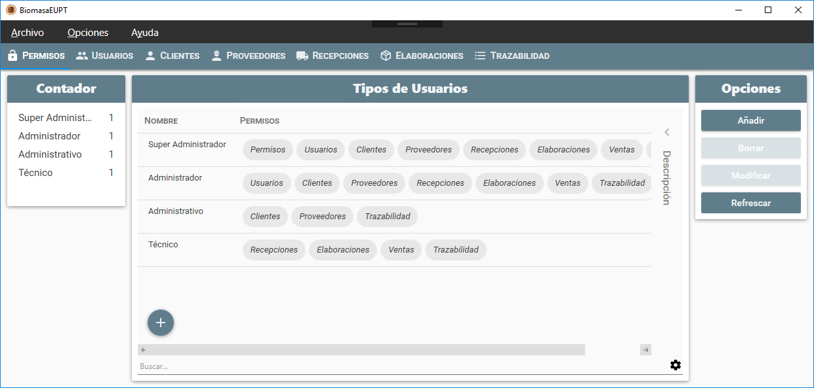

  

# [BiomasaEUPT](https://github.com/F0NT3/BiomasaEUPT)

BiomasaEUPT

## Supported platforms
Windows 7+ is supported (Windows 7, 8, 8.1, 10).

***

If you distribute a copy or make a fork of the project, you have to credit this project as the source.

This program is free software: you can redistribute it and/or modify it under the terms of the GNU General Public License as published by the Free Software Foundation, either version 3 of the License, or (at your option) any later version.

This program is distributed in the hope that it will be useful, but WITHOUT ANY WARRANTY; without even the implied warranty of MERCHANTABILITY or FITNESS FOR A PARTICULAR PURPOSE.  See the GNU General Public License for more details.

You should have received a copy of the GNU General Public License along with this program.  If not, see http://www.gnu.org/licenses/ .

***

Copyright (c) 2017 BiomasaEUPT Project - Released under the [GPL v3 license](LICENSE.txt).